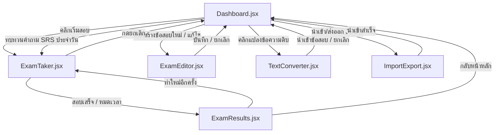

# ExamHub - ระบบฝึกซ้อมและทำข้อสอบแบบกระจายตัว (Exam Practice Web App)

แอปพลิเคชันเว็บแบบ Single Page Application (SPA) พัฒนาด้วย **Vite + React** และจัดรูปสไตล์ด้วย **Vanilla CSS** เพื่อช่วยให้ผู้ใช้สามารถฝึกทำข้อสอบ สร้างข้อสอบ และนำเข้าข้อสอบจากไฟล์ข้อความดิบ (เช่น ข้อความที่เจนจาก AI) ได้อย่างรวดเร็ว ข้อมูลทั้งหมดจะบันทึกค้างไว้ในระบบด้วย `LocalStorage` ของเบราว์เซอร์ และรองรับการทำสมการคณิตศาสตร์และตัวเอียง/ตัวหนา/บล็อกโค้ดแบบออฟไลน์ 100% (PWA)

---

## ✨ ฟีเจอร์เพิ่มเติมในเวอร์ชัน v1.1.0 (Medium Impact Features)

1. **⏱️ Mini Quiz**: เลือกจำนวนข้อสอบที่ต้องการทำได้ในหน้าจอก่อนเริ่มสอบ (เช่น 10, 20, 30, 50 ข้อ หรือทำทั้งหมด) พร้อมระบบคำนวณเวลาทำข้อสอบใหม่ตามอัตราส่วนของจำนวนข้อโดยอัตโนมัติ
2. **☀️/🌙 Light & Dark Glassmorphism**: ปุ่มสลับธีมใน Header รองรับทั้งธีมมืดและธีมสว่างสไตล์แก้วขาวโปร่งใส (Light Glassmorphism) ปราศจากส่วนหัวสีกระจัดกระจายและจดจำสถานะการเปลี่ยนธีม
3. **🧠 Spaced Repetition System (SRS)**: ระบบคัดกรองทบทวนคำถามตามกำหนดเวลาแบบ Anki เมื่อผู้ใช้ทำข้อสอบทั่วไปแล้วตอบผิด คำถามข้อนั้นจะถูกดึงเข้าสู่คิวทบทวนของระบบและโชว์ปุ่ม "ทบทวนคำถามผิด" บน Dashboard เมื่อถึงกำหนด (ตอบถูก = ระยะทบทวนคูณสอง, ตอบผิด = รีเซ็ตระยะเวลาเหลือ 1 วัน)
4. **🏷️ Question-Level Tags**: รองรับการระบุแท็ก/หัวข้อย่อยสำหรับคำถามแต่ละข้อในหน้าแก้ไข (Editor) และสามารถกรองสอบเฉพาะส่วนเนื้อหาที่สนใจได้ในหน้ารับข้อสอบ (Ready Screen)
5. **📝 Markdown & LaTeX Math Support**: ตัวช่วยเรนเดอร์ Markdown (ตัวหนา ตัวเอียง บล็อกโค้ดคอมพิวเตอร์) และการวาดรูปแบบสูตรสมการคณิตศาสตร์ LaTeX ผ่านไลบรารี KaTeX ในรูปแบบ `$inline$` และ `$$display$$` ใช้งานแบบออฟไลน์ได้ 100%

---

## 📂 โครงสร้างโฟลเดอร์และไฟล์ของโปรเจกต์ (Project Directory Structure)

```text
examApp/
├── index.html                  # ไฟล์ HTML หลักสำหรับโหลดระบบและฟอนต์ (Outfit, Sarabun, Inter)
├── package.json                # ข้อมูลไลบรารี สคริปต์รัน และตั้งค่าโปรเจกต์ (มี katex)
├── vite.config.js              # ค่าคอนฟิกของ Vite และการทำ PWA Caching (ฟอนต์ woff2 ของ KaTeX)
├── public/                     # โฟลเดอร์เก็บไฟล์สื่อและไอคอนภายนอก
└── src/
    ├── main.jsx                # จุดเริ่มรัน React และเชื่อมต่อกับ DOM (index.html)
    ├── App.jsx                 # ออร์เคสเตรเตอร์หลัก (ควบคุมการเปลี่ยนหน้า จัดการสเตทส่วนกลาง และจัดการระบบ SRS)
    ├── index.css               # ระบบดีไซน์สากล (Glassmorphism ทั้ง 2 ธีม, Dark/Light variable, Markdown spacing)
    ├── components/             # คอมโพเนนต์แยกแต่ละหน้าจอการทำงาน
    │   ├── Dashboard.jsx       # หน้าแดชบอร์ดหลัก แสดงสถิติ คลังข้อสอบ และปุ่มนำทาง SRS ทบทวนรายวัน
    │   ├── ExamTaker.jsx       # ระบบทำข้อสอบ (สุ่มโจทย์, Mini Quiz, ตัวกรอง Tag, Practice Mode)
    │   ├── ExamEditor.jsx      # หน้าต่างฟอร์มสำหรับเขียนคำถามย่อยและการติดป้าย Tags
    │   ├── ExamResults.jsx     # หน้าเฉลยคะแนน (มีกราฟ SVG, ตัวกรองข้อถูก/ผิด และตัวเรนเดอร์ Markdown)
    │   ├── TextConverter.jsx   # ตัวแปลงข้อความดิบเป็นข้อสอบอัตโนมัติ (อ่านเฉลยละเอียดและอ่านป้าย Tags)
    │   ├── MarkdownRenderer.jsx# คอมโพเนนต์แปลงคำสั่ง Markdown และจัดสูตรสมการ LaTeX (KaTeX)
    │   └── ImportExport.jsx    # หน้าต่างโมดอลป๊อปอัปสำหรับนำเข้า/ส่งออก JSON คลังข้อสอบ
    └── utils/
        └── defaultExams.js     # ชุดข้อสอบเริ่มต้นสำหรับใช้งานครั้งแรก (PCSAE XSOAR, JS, Science)
```

---

## 🏗️ แผนภาพสถาปัตยกรรมการทำงาน (Flow and Navigation Architecture)



---

## 💾 โครงสร้างข้อมูล (Data Models)

ข้อมูลทั้งหมดจะถูกจัดเก็บไว้ใน `LocalStorage` ภายใต้คีย์ดังต่อไปนี้:

### 1. `xamprep_exams`
อาเรย์เก็บชุดข้อสอบทั้งหมด มีโครงสร้างออบเจกต์ดังนี้:
```typescript
interface Exam {
  id: string;               // ตัวเลขระบุเฉพาะตัวสอบ เช่น exam-123456789
  title: string;            // ชื่อหัวข้อข้อสอบ / วิชา
  description: string;      // คำอธิบายวิชาสั้น ๆ
  timeLimit: number;        // จำกัดเวลาในการทำข้อสอบ (หน่วย: นาที)
  passPercentage: number;   // เกณฑ์คะแนนที่ถือว่าสอบผ่าน (เปอร์เซ็นต์ เช่น 70)
  questions: Question[];    // อาเรย์ของคำถาม
}

interface Question {
  id: string;               // รหัสคำถามเฉพาะ
  text: string;             // โจทย์คำถาม (รองรับ Markdown + LaTeX)
  type: "single-choice" | "multi-choice"; // ประเภทคำถาม (ช้อยส์เดียว หรือเลือกตอบหลายข้อ)
  options: string[];        // รายการตัวเลือก 4 ตัวเลือก [A, B, C, D] (รองรับ Markdown + LaTeX)
  correctAnswer: number | number[]; // ดัชนีเฉลย (เลขช้อยส์เดี่ยว หรือกลุ่มตัวเลขสำหรับ Multi-choice)
  explanation: string;      // คำอธิบายวิเคราะห์และเฉลยละเอียด (รองรับ Markdown + LaTeX)
  tags?: string[];          // หมวดหมู่แท็กย่อยสำหรับคำถามข้อนั้นๆ
}
```

### 2. `xamprep_history`
อาเรย์เก็บสถิติการสอบที่ทำเสร็จแล้วเพื่อคำนวณข้อมูลวิเคราะห์หน้าแดชบอร์ด:
```typescript
interface HistoryAttempt {
  id: string;               // รหัสรอบการสอบเฉพาะ
  examId: string;           // รหัสข้อสอบวิชาที่สอดคล้อง
  examTitle: string;        // ชื่อวิชาในขณะนั้น
  score: number;            // จำนวนข้อที่ทำได้ถูกต้อง
  totalQuestions: number;   // จำนวนข้อสอบทั้งหมด
  timeSpent: number;        // เวลาที่ใช้ไปจริงทั้งหมด (หน่วย: วินาที)
  userAnswers: (number | number[])[]; // อาเรย์คำตอบที่ผู้ใช้เลือก (เลขช้อยส์เดี่ยว หรือกลุ่มตัวเลือก)
  date: string;             // วันที่ทำข้อสอบ เช่น 15 มิ.ย. 2569, 11:30
}
```

### 3. `examhub_srs`
อาเรย์เก็บประวัติคำถามคิวทบทวนของระบบ Spaced Repetition (SRS) สำหรับข้อที่ตอบผิดสะสม:
```typescript
interface SrsCard {
  examId: string;           // รหัสข้อสอบวิชาหลัก
  examTitle: string;        // ชื่อหัวข้อวิชาสอบ
  questionId: string;       // รหัสคำถามย่อยที่ตอบผิด
  interval: number;         // ระยะเวลาความถี่การทบทวนครั้งถัดไป (หน่วย: วัน เช่น 1, 2, 4, 8, ...)
  nextReview: number;       // เวลาแสตมป์ Timestamp ที่จะครบกำหนดทบทวน (ในหน่วยมิลลิวินาที)
}
```

---

## 🔍 ตรรกะของระบบแปลงข้อความ (Text Parsing Logic)

ไฟล์ [TextConverter.jsx](file:///e:/_GG_Antigravity/examApp/src/components/TextConverter.jsx) จะทำการตัดแบ่งข้อความธรรมดาออกเป็นคำถามแต่ละข้ออัตโนมัติ โดยใช้การสแกนแบบบรรทัดต่อบรรทัดและเช็คเงื่อนไขด้วย Regex ดังนี้:

*   **คำถามใหม่ (New Question):** เช็คบรรทัดที่ขึ้นต้นด้วยตัวเลขตามด้วยเครื่องหมายจุดหรือวงเล็บ เช่น `/^(\d+[.)\-\s]+|Q\d+[:.\s]+)(.*)/i`
*   **ตัวเลือก (Options):** เช็คบรรทัดช้อยส์ A-G หรือ ก-จ เช่น `/^([A-Ga-gก-จ])[.)\-\s:]+(.*)/`
*   **เฉลย (Answer):** ค้นหาคีย์เวิร์ดบอกคำตอบ เช่น `/^(Answer|เฉลย|Ans|คำตอบ|เฉลยข้อ)[\s:\-=]+([A-Ga-gก-จ1-7]|\d)/i`
*   **คำอธิบาย (Explanation):** ค้นหาคำจำพวก `/^(Explanation|คำอธิบาย|เฉลยละเอียด|เหตุผล|คำแปล)[\s:\-=]+(.*)/i`
*   **แท็กย่อย (Tags):** ตรวจจับบรรทัดแท็กเพื่อใส่คำค้นหาย่อย เช่น `/^(Tags|Tag|แท็ก|ป้ายกำกับ)[\s:\-=]+(.*)/i`

---

## 💻 วิธีการติดตั้งและรันใช้งาน (Installation & Run Guide)

### 1. การเปิดใช้งานโหมดผู้พัฒนา (Development)
เปิด Terminal ในโฟลเดอร์โปรเจกต์และสั่งติดตั้งโปรแกรมก่อนในครั้งแรก:
```bash
npm install
```
จากนั้นเปิดเซิร์ฟเวอร์จำลอง:
```bash
npm run dev
```
เข้าใช้งานผ่าน URL: **[http://localhost:5173/](http://localhost:5173/)**

### 2. การสร้างไฟล์ผลิตจริง (Build Production)
หากต้องการนำหน้าเว็บไปขึ้นเซิร์ฟเวอร์หลัก (Hosting) ให้สั่งบิลด์ไฟล์:
```bash
npm run build
```
ไฟล์พร้อมใช้งานทั้งหมดจะถูกแพ็ครวมกันอยู่ในโฟลเดอร์ `dist/` ซึ่งมีความเสถียรและเร็วมาก มีระบบจัดเก็บ precache สำหรับสมการคณิตศาสตร์ให้รันออฟไลน์เป็น Progressive Web App ได้ทันที
