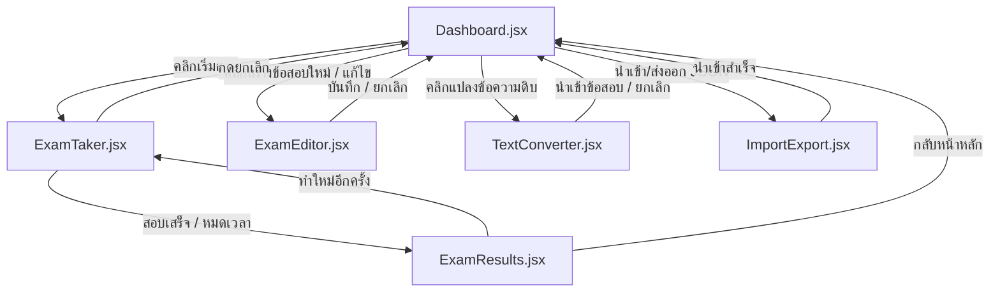

# ExamHub - ระบบฝึกซ้อมและทำข้อสอบแบบกระจายตัว (Exam Practice Web App)

แอปพลิเคชันเว็บแบบ Single Page Application (SPA) พัฒนาด้วย **Vite + React** และจัดรูปสไตล์ด้วย **Vanilla CSS** เพื่อช่วยให้ผู้ใช้สามารถฝึกทำข้อสอบ สร้างข้อสอบ และนำเข้าข้อสอบจากไฟล์ข้อความดิบ (เช่น ข้อความที่เจนจาก AI) ได้อย่างรวดเร็ว ข้อมูลทั้งหมดจะบันทึกค้างไว้ในระบบด้วย `LocalStorage` ของเบราว์เซอร์

---

## 📂 โครงสร้างโฟลเดอร์และไฟล์ของโปรเจกต์ (Project Directory Structure)

```text
examApp/
├── index.html                  # ไฟล์ HTML หลักสำหรับโหลดระบบและฟอนต์ (Outfit, Sarabun, Inter)
├── package.json                # ข้อมูลไลบรารี สคริปต์รัน และตั้งค่าโปรเจกต์
├── vite.config.js              # ค่าคอนฟิกเริ่มต้นของ Vite
├── public/                     # โฟลเดอร์เก็บไฟล์สื่อและไอคอนภายนอก
└── src/
    ├── main.jsx                # จุดเริ่มรัน React และเชื่อมต่อกับ DOM (index.html)
    ├── App.jsx                 # ออร์เคสเตรเตอร์หลัก (ควบคุมการเปลี่ยนหน้าและจัดการสเตทส่วนกลาง)
    ├── index.css               # ระบบดีไซน์สากล (Glassmorphism, Dark Theme, Scrollbar, Keyframes)
    ├── components/             # คอมโพเนนต์แยกแต่ละหน้าจอการทำงาน
    │   ├── Dashboard.jsx       # หน้าแดชบอร์ดหลัก แสดงสถิติและคลังข้อสอบ
    │   ├── ExamTaker.jsx       # ระบบทำข้อสอบ (จับเวลา, ปักธงทบทวน, และ Practice Mode)
    │   ├── ExamEditor.jsx      # หน้าต่างฟอร์มสำหรับเขียนและแก้ไขข้อสอบเองทีละข้อ
    │   ├── ExamResults.jsx     # หน้าเฉลยคะแนน (มีกราฟวงกลม SVG และตัวกรองข้อถูก/ผิด)
    │   ├── TextConverter.jsx   # ตัวแปลงข้อความดิบ (Raw Text) เป็นข้อสอบเข้าระบบอัตโนมัติ
    │   └── ImportExport.jsx    # หน้าต่างโมดอลป๊อปอัปสำหรับคัดลอก/วางรหัส JSON
    └── utils/
        └── defaultExams.js     # ชุดข้อสอบเริ่มต้นสำหรับใช้งานครั้งแรก (XSOAR, JS, Science)
```

---

## 🏗️ แผนภาพสถาปัตยกรรมการทำงาน (Flow and Navigation Architecture)



---

## 💾 โครงสร้างข้อมูล (Data Models)

ข้อมูลทั้งหมดจะถูกจัดเก็บไว้ใน `LocalStorage` ภายใต้คีย์ดังต่อไปนี้:

### 1. `xamprep_exams`
อาเรย์เก็บชุดข้อสอบทั้งหมด มีโครงสร้างออบเจกต์ดังนี้:
```typescript
interface Exam {
  id: string;               // ตัวเลขระบุเฉพาะตัวสอบ เช่น exam-123456789
  title: string;            // ชื่อหัวข้อข้อสอบ / วิชา
  description: string;      // คำอธิบายวิชาสั้น ๆ
  timeLimit: number;        // จำกัดเวลาในการทำข้อสอบ (หน่วย: นาที)
  passPercentage: number;   // เกณฑ์คะแนนที่ถือว่าสอบผ่าน (เปอร์เซ็นต์ เช่น 70)
  questions: Question[];    // อาเรย์ของคำถาม
}

interface Question {
  id: string;               // รหัสคำถามเฉพาะ
  text: string;             // โจทย์คำถาม
  type: "single-choice";    // ประเภทคำถาม (เลือกตอบช้อยส์เดียว)
  options: string[];        // รายการตัวเลือก 4 ตัวเลือก [A, B, C, D]
  correctAnswer: number;    // ดัชนีข้อเฉลยที่ถูกต้อง (0 = A, 1 = B, 2 = C, 3 = D)
  explanation: string;      // คำอธิบายวิเคราะห์และเฉลยละเอียด
}
```

### 2. `xamprep_history`
อาเรย์เก็บสถิติการสอบที่ทำเสร็จแล้วเพื่อคำนวณข้อมูลหน้าแดชบอร์ด:
```typescript
interface HistoryAttempt {
  id: string;               // รหัสรอบการสอบเฉพาะ
  examId: string;           // รหัสข้อสอบวิชาที่สอดคล้อง
  examTitle: string;        // ชื่อวิชาในขณะนั้น
  score: number;            // จำนวนข้อที่ทำได้ถูกต้อง
  totalQuestions: number;   // จำนวนข้อสอบทั้งหมด
  timeSpent: number;        // เวลาที่ใช้ไปจริงทั้งหมด (หน่วย: วินาที)
  userAnswers: number[];    // อาเรย์ของคำตอบที่ผู้ใช้เลือก (จับคู่ตามดัชนีคำถาม)
  date: string;             // วันที่ทำข้อสอบ เช่น 15 มิ.ย. 2026, 11:30
}
```

---

## 🔍 ตรรกะของระบบแปลงข้อความ (Text Parsing Logic)

ไฟล์ [TextConverter.jsx](file:///e:/_GG_Antigravity/examApp/src/components/TextConverter.jsx) จะทำการตัดแบ่งข้อความธรรมดาออกเป็นคำถามแต่ละข้ออัตโนมัติ โดยใช้การสแกนแบบบรรทัดต่อบรรทัดและเช็คเงื่อนไขด้วย Regex ดังนี้:

*   **คำถามใหม่ (New Question):** เช็คบรรทัดที่ขึ้นต้นด้วยตัวเลขตามด้วยเครื่องหมายจุดหรือวงเล็บ เช่น `/^(\d+[\.\)\-\s]+|Q\d+[:\.\s]+)(.*)/`
*   **ตัวเลือก (Options):** เช็คบรรทัดช้อยส์ A-D หรือ ก-ง เช่น `/^([A-D|a-d|ก-ง])[\.\)\-\s\:]+(.*)/`
*   **เฉลย (Answer):** ค้นหาคีย์เวิร์ดบอกคำตอบ เช่น `/^(Answer|เฉลย|Ans|คำตอบ|เฉลยข้อ)[\s\:\-=]+([A-D|a-d|ก-ง|1-4]|\d)/`
*   **คำอธิบาย (Explanation):** ค้นหาคำจำพวก `/^(Explanation|คำอธิบาย|เฉลยละเอียด|เหตุผล|คำแปล)[\s\:\-=]+(.*)/`

---

## 💻 วิธีการติดตั้งและรันใช้งาน (Installation & Run Guide)

### 1. การเปิดใช้งานโหมดผู้พัฒนา (Development)
เปิด Terminal ในโฟลเดอร์โปรเจกต์และสั่งติดตั้งโปรแกรมก่อนในครั้งแรก:
```bash
npm install
```
จากนั้นเปิดเซิร์ฟเวอร์จำลอง:
```bash
npm run dev
```
เข้าใช้งานผ่าน URL: **[http://localhost:5173/](http://localhost:5173/)**

### 2. การสร้างไฟล์ผลิตจริง (Build Production)
หากต้องการนำหน้าเว็บไปขึ้นเซิร์ฟเวอร์หลัก (Hosting) ให้สั่งบิลด์ไฟล์:
```bash
npm run build
```
ไฟล์พร้อมใช้งานทั้งหมดจะถูกแพ็ครวมกันอยู่ในโฟลเดอร์ `dist/` ซึ่งมีความเสถียรและเร็วมาก (สามารถดับเบิ้ลคลิกหรือรันเว็บแบบ Static ได้เลย)
